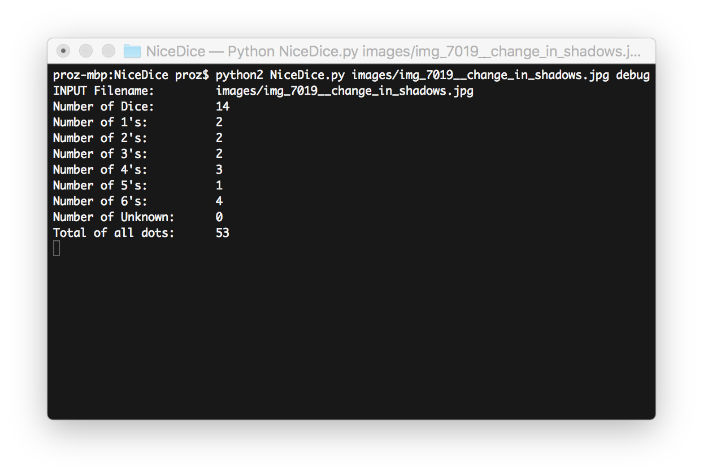
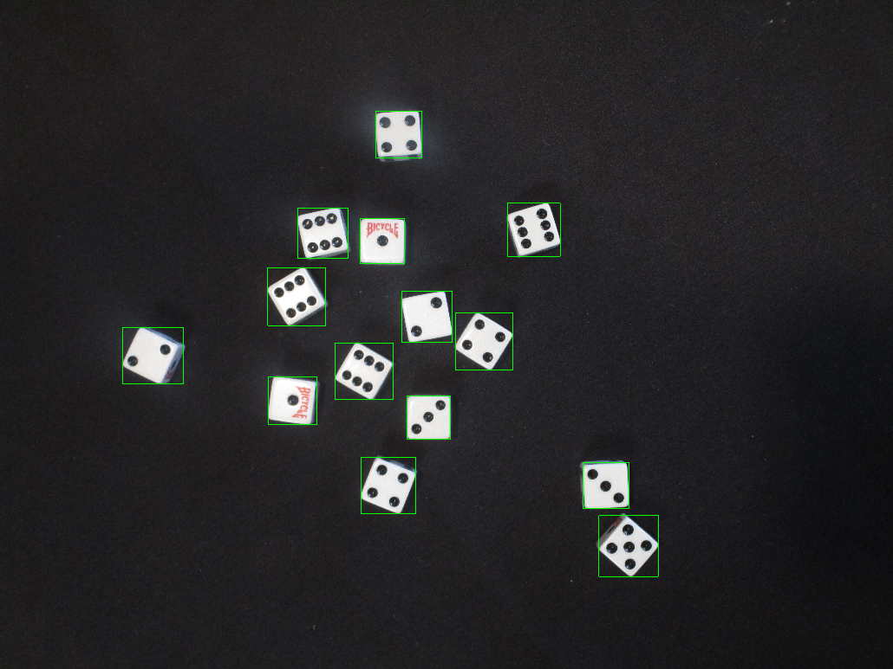
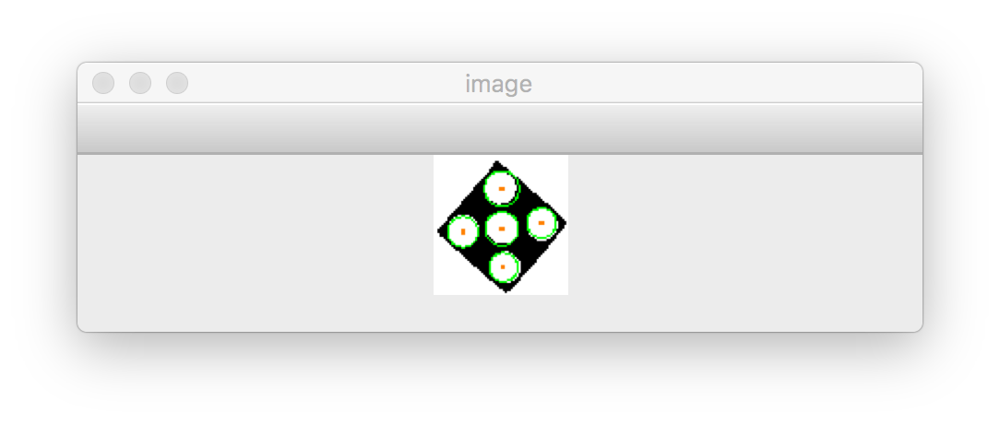

# NiceDice
An image processor for a set of images of dice

## Output

This program outputs:
- The image filename
- The quantity of dice detected
- The frequency of each pip quantity detected
- The amount of dice detected whose pips cannot be determined
- The total amount of pips detected

## Usage
>$ python2 NiceDice.py \<image filename\> [debug]

The word ‘debug’ is the option to display the image. 
It will first display the original image with the dice bounded in axis parallel rectangles.
It will then display each die with Hough circles in each detected pip.
Press spacebar to cycle through debug images.

## Sample Run
Sample console output:

 
 Sample debug image:
 

 
 Sample pip debug image:
 

## Supplied Images
Image descriptions:
- 6868: The Bicycle logo causes an anomalous pip detection in one of the dice
- 6918: The find contour function detects the change in background in the top right as a die
- 6938: Perfect run
- 7019: Perfect run
- 7110: Perfect run
- 7140: Two dice are oriented too close for them to be differentiated, resulting in classification as a die with 3 pips instead of two dice with 1 and 2 pips
- 7191: The image has significant motion blur
- 7222: The image has no dice and a blank background

More images are available upon request.
